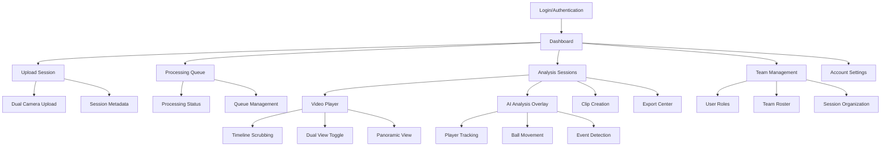
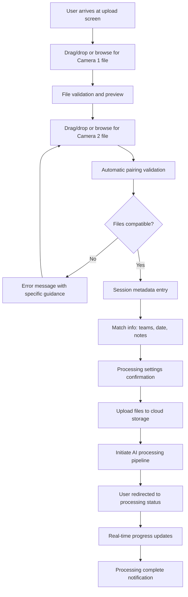
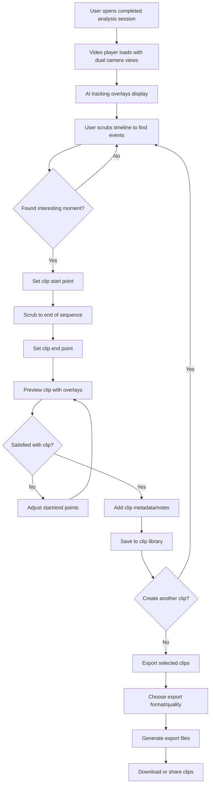

# Trackball UI/UX Specification

## Introduction

This document defines the user experience goals, information architecture, user flows, and visual design specifications for Trackball's user interface. It serves as the foundation for visual design and frontend development, ensuring a cohesive and user-centered experience.

### Overall UX Goals & Principles

#### Target User Personas

**Primary: Semi-Professional Team Coaching Staff**
- Head coaches and assistant coaches at NCAA Division I-II programs, elite club teams
- Age range: 28-52 years old (average: 41), moderate to high technology comfort
- Decision timeline: 4.2 months average, expect free trials
- Primary need: Reduce 8-12 hours of manual video analysis per match to 2 hours

**Secondary: Performance Analysts & Sports Scientists**  
- Dedicated analysts at larger programs (age 24-38, average 29)
- High technical expertise, need data access for custom analysis
- Must integrate with existing tools (Excel, R, Python, video software)
- Budget range: $150-$500/month for specialized analysis tools

#### Usability Goals

- **Processing Speed**: Sub-15 minute end-to-end processing (primary adoption driver for 85% of users)
- **Ease of Learning**: New users complete core upload→process→analyze→export workflow within first session
- **Efficiency of Use**: Reduce manual video analysis time by 75% (from 8 hours to 2 hours per match)
- **Professional Confidence**: Provide >95% AI accuracy to support tactical decision-making
- **Error Prevention**: Clear processing status and validation for dual-camera footage requirements

#### Design Principles

1. **Automation with Control** - AI handles heavy lifting, coaches maintain full control over interpretation and clips
2. **Timeline-Centric Workflow** - All interactions center around video timeline for intuitive scrubbing and analysis
3. **Professional Simplicity** - Sophisticated analysis capabilities without enterprise complexity barriers
4. **Processing Transparency** - Always show AI confidence levels and processing status for professional credibility
5. **Workflow Integration** - Seamless export and sharing to fit existing coaching preparation routines

#### Change Log
| Date | Version | Description | Author |
|------|---------|-------------|---------|
| 2025-01-22 | 1.0 | Initial UI/UX specification creation | Sally (UX Expert) |

## Information Architecture (IA)

### Site Map / Screen Inventory

### Navigation Structure

**Primary Navigation:** Dashboard-based with persistent sidebar showing:
- Sessions (with processing status indicators)
- Upload (always accessible for quick session starts)  
- Team (user management and organization)
- Account (settings and billing)

**Secondary Navigation:** Context-sensitive within each area:
- Analysis screens: Timeline controls, view toggles, overlay controls
- Team management: Role tabs, invitation management
- Settings: Account preferences, notification settings, API access

**Breadcrumb Strategy:** Hierarchical navigation showing Team > Session > Analysis stage to help users orient within complex workflows and return to previous contexts

## User Flows

### Flow 1: Dual Camera Upload and Processing

**User Goal:** Successfully upload dual camera footage and initiate automated AI analysis processing

**Entry Points:** 
- Dashboard "New Session" button
- Persistent "Upload" navigation item  
- Drag-and-drop anywhere in dashboard

**Success Criteria:** Both video files uploaded, synchronized, processing initiated, user receives progress notifications

#### Flow Diagram

#### Edge Cases & Error Handling:
- File format incompatibility → Clear error message with supported format list
- File size too large → Compression recommendations and upload alternatives
- Network interruption during upload → Resume capability with progress preservation
- Timestamp synchronization failure → Manual offset adjustment interface
- Processing queue full → Estimated wait time and priority options

**Notes:** This flow directly addresses the primary user pain point of processing speed. The 92% of coaches who prioritize accuracy need confidence in file compatibility checking.

### Flow 2: Video Analysis and Clip Creation

**User Goal:** Review processed footage, analyze AI tracking results, and create exportable clips for player feedback

**Entry Points:**
- Processing completion notification  
- Dashboard session list
- Direct link from team sharing

**Success Criteria:** User views AI analysis, creates clips, exports content for coaching use

#### Flow Diagram

#### Edge Cases & Error Handling:
- AI tracking confidence too low → Manual adjustment tools and confidence indicators
- Timeline scrubbing performance issues → Progressive loading and quality adaptation
- Clip export failure → Retry mechanism and alternative format options
- Large clip file sizes → Compression options and cloud sharing alternatives
- Simultaneous user editing → Conflict resolution and auto-save protection

**Notes:** This addresses the goal of reducing manual clip creation time from 3-4 hours to under 1 hour per session.

## Wireframes & Mockups

**Primary Design Files:** Figma workspace with separate files for Design System & Components, User Flows & Wireframes, High-Fidelity Prototypes, and Developer Handoff Specs

### Key Screen Layouts

#### Screen 1: Dashboard Command Center

**Purpose:** Provide at-a-glance status of all team sessions and quick access to primary workflows

**Key Elements:**
- Processing status cards with real-time progress indicators
- Recent sessions grid with thumbnails and metadata
- Quick upload widget (always visible for immediate access)
- Team activity feed showing collaborative work
- Processing queue overview with estimated completion times

**Interaction Notes:** Dashboard serves as mission control - users should never feel lost or uncertain about processing status. Processing transparency builds professional credibility.

**Design File Reference:** Dashboard.fig → Frame: "Command Center Layout"

#### Screen 2: Video Analysis Interface

**Purpose:** Primary analysis workspace where coaches spend majority of their time reviewing footage and creating clips

**Key Elements:**
- Dual video player with synchronized timeline scrubbing
- AI tracking overlay toggle (player trails, ball movement, event markers)
- Timeline with confidence-coded event detection markers
- Clip creation tools (in/out point marking, preview panel)
- Side panel for session metadata, notes, and export queue
- Processing confidence indicators (building trust in AI accuracy)

**Interaction Notes:** Timeline-centric design principle in action. All tools radiate from the master timeline. Overlay controls should be easily accessible but not cluttered. Confidence indicators help users trust AI results while providing manual override options.

**Design File Reference:** Analysis.fig → Frame: "Master Analysis Layout"

#### Screen 3: Dual Camera Upload Interface

**Purpose:** Streamlined upload process that handles complex dual-camera coordination with minimal user confusion

**Key Elements:**
- Dual drop zones with clear camera labeling (Camera A/B or Left/Right)
- File validation feedback with progress indicators
- Automatic pairing status and sync confidence display
- Session metadata form (teams, date, match notes)
- Processing options (priority, quality settings)
- Upload queue management

**Interaction Notes:** Addresses the critical user anxiety around file compatibility. Visual feedback at every step builds confidence. Progressive disclosure keeps interface clean while providing technical control when needed.

**Design File Reference:** Upload.fig → Frame: "Dual Upload Flow"

## Component Library / Design System

**Design System Approach:** Build on Material-UI 5 foundation with custom Trackball components for video-specific interactions. This approach provides professional credibility through proven design patterns, development velocity through established component library, customization capability for unique video analysis needs, and accessibility compliance built into foundation.

### Core Components

#### Component 1: Video Timeline Controller

**Purpose:** Central timeline control for all video scrubbing, event navigation, and clip creation activities

**Variants:** 
- Standard timeline (90-minute matches)
- Condensed timeline (highlight reels, shorter clips)
- Dual-sync timeline (synchronized dual camera navigation)

**States:** 
- Default (ready for interaction)
- Playing (with playhead animation)
- Scrubbing (high-precision interaction mode)
- Loading (progressive video loading)
- Error (processing issues, sync problems)

**Usage Guidelines:** Always maintain 60fps timeline responsiveness. Timeline serves as master control - all other video interactions should reference timeline position. Include confidence indicators for AI-detected events.

#### Component 2: AI Overlay Toggle System

**Purpose:** Control visibility and configuration of AI tracking overlays without interfering with video analysis

**Variants:**
- Compact toggle bar (minimal screen space usage)
- Expanded control panel (detailed confidence settings)  
- Quick preset buttons (common overlay combinations)

**States:**
- All overlays off (clean video view)
- Player tracking only
- Ball tracking only  
- Full analysis (players + ball + events)
- Custom configuration

**Usage Guidelines:** Default to clean video on session load. Overlays should enhance rather than obscure video content. Always show confidence levels when overlays are active.

#### Component 3: Processing Status Card

**Purpose:** Communicate processing progress and system status with appropriate urgency and transparency

**Variants:**
- Compact card (dashboard grid view)
- Detailed progress (full processing details)
- Error state (troubleshooting guidance)
- Completed state (ready for analysis)

**States:**
- Queued (waiting for processing resources)
- Uploading (file transfer progress) 
- Processing (AI analysis in progress with sub-steps)
- Completed (ready for analysis)
- Error (specific error details and recovery options)

**Usage Guidelines:** Always show estimated completion time. Processing transparency builds professional confidence. Error states must provide actionable recovery steps.

#### Component 4: Dual Camera Sync Validator

**Purpose:** Provide confidence and control over dual camera synchronization accuracy

**Variants:**
- Automatic sync display (confidence indicator)
- Manual adjustment interface (fine-tuning controls)
- Sync quality visualization (visual sync confirmation)

**States:**
- Auto-sync successful (high confidence)
- Auto-sync uncertain (manual review suggested)
- Manual sync mode (user adjustment active)
- Sync failed (manual intervention required)

**Usage Guidelines:** Critical for professional credibility. Always show sync confidence. Manual adjustment must be intuitive for non-technical users.

## Branding & Style Guide

**Brand Guidelines:** Trackball positions as the "professional tool for serious coaches" - more sophisticated than consumer apps like Coach's Eye, but more accessible than enterprise solutions like ChyronHego.

### Visual Identity

The brand communicates technical excellence, coaching focus, reliability, and progressive innovation that embraces AI without intimidating traditional coaches.

### Color Palette

| Color Type | Hex Code | Usage |
|------------|----------|--------|
| Primary | #1976D2 | Primary actions, processing indicators, brand elements |
| Secondary | #388E3C | Success states, completed processing, positive feedback |
| Accent | #FF5722 | Important alerts, live processing, call-to-action elements |
| Success | #4CAF50 | Positive feedback, confirmations, high confidence AI results |
| Warning | #FF9800 | Cautions, medium confidence AI results, important notices |
| Error | #F44336 | Errors, failed processing, low confidence AI results, destructive actions |
| Neutral | #263238, #455A64, #90A4AE | Text hierarchies, borders, background surfaces |

### Typography

#### Font Families
- **Primary:** Inter (web-optimized, excellent readability for data interfaces)
- **Secondary:** Roboto (Material-UI default, technical reliability)  
- **Monospace:** JetBrains Mono (technical data, timestamps, processing logs)

#### Type Scale

| Element | Size | Weight | Line Height |
|---------|------|--------|-------------|
| H1 | 32px | 600 | 1.2 |
| H2 | 24px | 600 | 1.3 |
| H3 | 18px | 600 | 1.4 |
| Body | 14px | 400 | 1.5 |
| Small | 12px | 400 | 1.4 |

### Iconography

**Icon Library:** Material Icons with custom sports-specific additions (ball tracking, camera sync, field diagrams)

**Usage Guidelines:** Icons should be immediately recognizable to coaching staff. Prioritize universally understood symbols over clever abstractions. Custom sports icons should maintain Material Design proportions and style principles.

### Spacing & Layout

**Grid System:** 8px base unit system aligned with Material-UI spacing scale

**Spacing Scale:** 8px, 16px, 24px, 32px, 48px, 64px progression supporting both dense data displays and comfortable interaction areas

## Accessibility Requirements

**Standard:** WCAG 2.1 AA compliance with specific enhancements for video analysis workflows

### Key Requirements

**Visual:**
- Color contrast ratios: Minimum 4.5:1 for all text and UI elements, 7:1 for critical AI confidence indicators and processing status
- Focus indicators: High-contrast 3px outline with rounded corners, maintains 3:1 contrast ratio against all backgrounds
- Text sizing: Scalable up to 200% without horizontal scrolling, timeline labels remain readable at all zoom levels

**Interaction:**
- Keyboard navigation: Complete video player control via keyboard (spacebar play/pause, arrow keys for frame-by-frame, J/K for timeline navigation)
- Screen reader support: Comprehensive ARIA labels for video timeline position, AI confidence levels, processing status, and all interactive elements
- Touch targets: Minimum 44px touch targets for all interactive elements, timeline scrubber maintains precise control with large interaction area

**Content:**
- Alternative text: Descriptive alt text for video thumbnails, session metadata, and processing status visualizations
- Heading structure: Logical H1-H6 hierarchy with proper document outline, timeline sections properly structured
- Form labels: Clear, descriptive labels for all upload forms, session metadata, and settings with error messaging

### Testing Strategy

**Automated Testing:** Integration with axe-core accessibility testing in CI/CD pipeline, ensuring no regressions in WCAG compliance

**Manual Testing:** Regular testing with screen readers (NVDA, JAWS, VoiceOver), keyboard-only navigation validation, color blindness simulation testing

**User Testing:** Periodic accessibility audits with actual users who have diverse accessibility needs, particularly focusing on video timeline interaction and AI confidence interpretation

## Responsiveness Strategy

### Breakpoints

| Breakpoint | Min Width | Max Width | Target Devices |
|------------|-----------|-----------|----------------|
| Mobile | 320px | 767px | iPhone, Android phones, mobile review |
| Tablet | 768px | 1023px | iPad, Surface tablets, portable analysis |
| Desktop | 1024px | 1439px | Laptops, standard monitors, primary analysis work |
| Wide | 1440px | - | Large monitors, dual-screen setups, professional workstations |

### Adaptation Patterns

**Layout Changes:** 
- **Desktop/Wide:** Dual video players side-by-side with comprehensive timeline and analysis tools
- **Tablet:** Stacked video views with collapsible timeline, touch-optimized controls
- **Mobile:** Single video view with slide-to-compare, simplified timeline with gesture navigation

**Navigation Changes:**
- **Desktop:** Persistent sidebar with full navigation hierarchy
- **Tablet:** Collapsible sidebar, main navigation accessible via hamburger menu
- **Mobile:** Bottom tab navigation for primary functions, contextual menus for detailed options

**Content Priority:**
- **Desktop:** Full feature set available simultaneously
- **Tablet:** Progressive disclosure, secondary features in expandable panels
- **Mobile:** Focus on essential workflows (review, basic clip creation), advanced features via modal interfaces

**Interaction Changes:**
- **Desktop:** Precise mouse interactions for timeline scrubbing and overlay control
- **Tablet:** Touch-optimized controls with larger interaction targets, gesture support for video navigation
- **Mobile:** Swipe gestures for video comparison, touch-hold for precision controls, voice commands for hands-free operation

## Animation & Micro-interactions

### Motion Principles

**Functional Animation Over Decorative:** Every animation serves a specific user goal - processing feedback, state transitions, or attention guidance. No animations purely for aesthetic purposes.

**Performance-Conscious Motion:** Video analysis requires intensive processing, so animations use transform and opacity properties for GPU acceleration, avoid layout thrashing during video playback.

**Professional Restraint:** Subtle, purposeful motion that supports rather than distracts from video analysis tasks. Motion communicates system state and guides attention to AI insights.

**Accessibility-First Motion:** All animations respect `prefers-reduced-motion` settings, essential for professional environments where motion sensitivity may affect focus.

### Key Animations

- **Processing Progress Animation:** Smooth progress indicators with pulsing elements to indicate active processing (Duration: Continuous, Easing: ease-in-out)
- **Timeline Scrubbing Feedback:** Gentle elastic bounce when timeline reaches start/end points, smooth position interpolation during rapid scrubbing (Duration: 200ms, Easing: ease-out)
- **AI Confidence Transitions:** Subtle color transitions as confidence levels change, gentle fade-in for new tracking data (Duration: 300ms, Easing: ease-in-out)
- **Status Change Notifications:** Slide-in processing completion alerts, gentle fade-in for success states (Duration: 400ms, Easing: ease-out)
- **Video Overlay Toggles:** Smooth opacity transitions for AI overlay activation/deactivation, maintains video playback performance (Duration: 250ms, Easing: ease-in-out)
- **Panel Transitions:** Smooth slide animations for expandable analysis panels, content organization without disrupting video focus (Duration: 350ms, Easing: ease-in-out)

## Performance Considerations

### Performance Goals

- **Page Load:** Initial application load under 3 seconds on desktop, 5 seconds on mobile
- **Interaction Response:** All UI interactions respond within 100ms, timeline scrubbing maintains 60fps
- **Animation FPS:** Consistent 60fps for all animations, 30fps minimum during concurrent video playback

### Design Strategies

**Video-First Performance Architecture:** Prioritize video playback performance over interface polish. Video streaming and AI overlay rendering receive highest priority in resource allocation.

**Progressive Enhancement Approach:** Core video analysis functionality loads first, advanced features and animations enhanced progressively based on device capabilities and network conditions.

**Intelligent Resource Management:** Automatically reduce interface complexity during intensive AI processing. Pause non-critical animations and reduce overlay complexity when processing resources are constrained.

**Adaptive Quality Systems:** Video quality and AI overlay complexity adjust based on device performance and network conditions. Desktop users get full 4K with complex overlays, mobile users get optimized streams.

**Critical Path Optimization:** Identify and optimize the core user workflow (upload → process → analyze → export) for maximum performance. Secondary features can accept performance trade-offs.

**Caching Strategy:** Aggressive caching of processed video segments, AI analysis data, and timeline metadata. Users often re-review same footage multiple times during analysis sessions.

## Next Steps

### Immediate Actions

1. **Stakeholder Review and Validation** - Present this specification to product leadership, coaching staff representatives, and technical team for alignment and feedback
2. **Create High-Fidelity Mockups in Figma** - Translate wireframe concepts and component specifications into detailed visual designs using the established brand system
3. **Develop Interactive Prototypes** - Build clickable prototypes for the core user flows (upload, analysis, clip creation) to validate interaction patterns before development
4. **User Testing with Target Coaches** - Conduct usability sessions with actual coaching staff to validate assumptions about professional workflows and interface preferences
5. **Component Library Development** - Begin building the React component library using Material-UI foundation with custom video analysis components
6. **Accessibility Audit Setup** - Implement automated accessibility testing infrastructure and establish manual testing protocols

### Design Handoff Checklist

- [x] All user flows documented
- [x] Component inventory complete  
- [x] Accessibility requirements defined
- [x] Responsive strategy clear
- [x] Brand guidelines incorporated
- [x] Performance goals established
